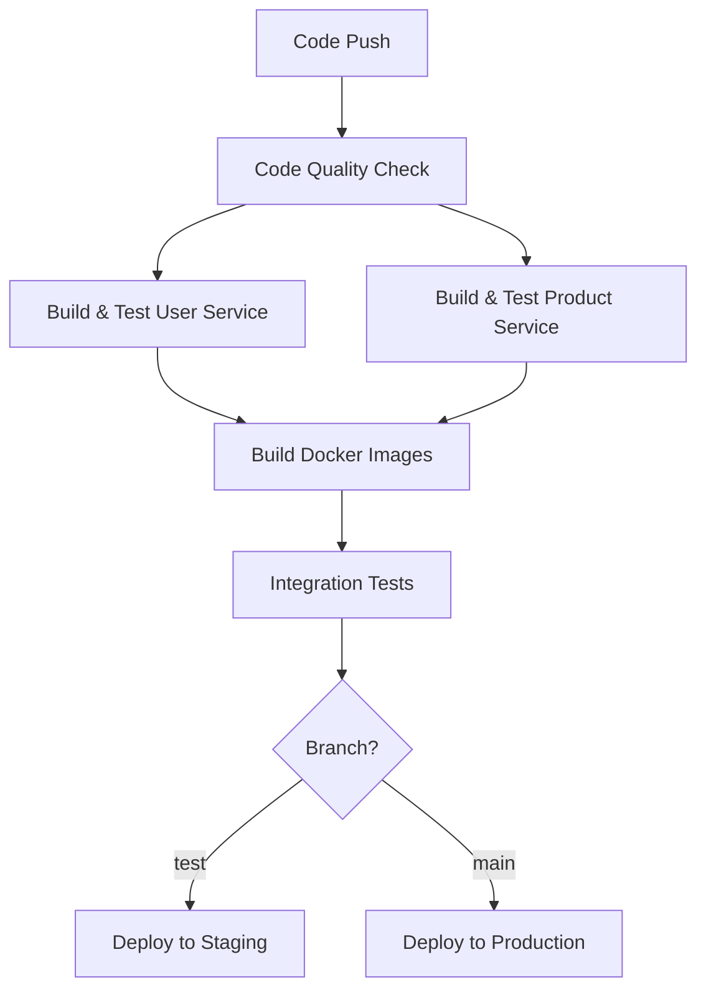

# GitHub Actions CI/CD Pipeline

This repository uses GitHub Actions for automated CI/CD pipelines for the backend microservices.

## 🚀 Workflows Overview

### 1. **Backend CI/CD Pipeline** (`backend-ci.yml`)
**Triggers:** Push to `main`/`test` branches, PRs to `main`
- ✅ Code quality checks
- 🧪 Build and test both services
- 🐳 Build Docker images and push to GitHub Container Registry
- 🔗 Integration tests with Docker Compose
- 🚀 Auto-deploy to staging (`test` branch) or production (`main` branch)

### 2. **Manual Deployment** (`manual-deploy.yml`)
**Triggers:** Manual workflow dispatch
- 🎯 Deploy specific services to chosen environments
- 🔄 Rollback capabilities
- 🏷️ Deploy specific versions/tags

### 3. **Release Pipeline** (`release.yml`)
**Triggers:** Git tags (`v*.*.*`) or GitHub releases
- 📦 Build release artifacts
- 🏷️ Tag Docker images with version numbers
- 📋 Upload release assets

### 4. **Health Check** (`health-check.yml`)
**Triggers:** Scheduled (every 6 hours) or manual
- 💚 Monitor service health
- 🧪 Basic functionality tests
- 🚨 Failure notifications

## 🔧 Setup Instructions

### 1. Enable GitHub Container Registry
The workflows push Docker images to GitHub Container Registry (ghcr.io). This is automatically enabled for your repository.

### 2. Configure Environments (Optional)
Go to **Settings > Environments** and create:
- `staging` - for test branch deployments
- `production` - for main branch deployments

Add protection rules if needed (require reviews, etc.).

### 3. Repository Secrets (If needed)
The workflows use `GITHUB_TOKEN` which is automatically provided. Add additional secrets in **Settings > Secrets and variables > Actions** if you need:
- Cloud provider credentials
- Database connection strings
- API keys

## 📊 Pipeline Flow

## 🐳 Docker Images

Images are pushed to GitHub Container Registry:
- `ghcr.io/YOUR_USERNAME/user-service:latest`
- `ghcr.io/YOUR_USERNAME/product-service:latest`
- `ghcr.io/YOUR_USERNAME/user-service:COMMIT_SHA`
- `ghcr.io/YOUR_USERNAME/product-service:COMMIT_SHA`

## 🏷️ Release Process

1. Create a git tag: `git tag v1.0.0`
2. Push the tag: `git push origin v1.0.0`
3. Or create a GitHub release through the web interface
4. The release pipeline will automatically build and tag images

## 🔍 Monitoring

- **Build Status:** Check the Actions tab
- **Docker Images:** Go to Packages tab to see built images
- **Health Checks:** Automated every 6 hours
- **Logs:** Available in each workflow run

## 🛠️ Manual Operations

### Deploy Manually
1. Go to **Actions > Manual Deployment**
2. Click **Run workflow**
3. Choose environment, service, and version
4. Click **Run workflow**

### Run Health Check
1. Go to **Actions > Health Check**
2. Click **Run workflow**

## 📈 Next Steps

1. **Add Real Deployment Targets:**
   - Heroku, Railway, or cloud providers
   - Kubernetes clusters
   - Docker Swarm

2. **Enhanced Testing:**
   - Add unit tests to your services
   - Integration test suites
   - Performance testing

3. **Security:**
   - Vulnerability scanning
   - SAST (Static Application Security Testing)
   - Dependency checks

4. **Monitoring:**
   - Application metrics
   - Log aggregation
   - Alerting systems
